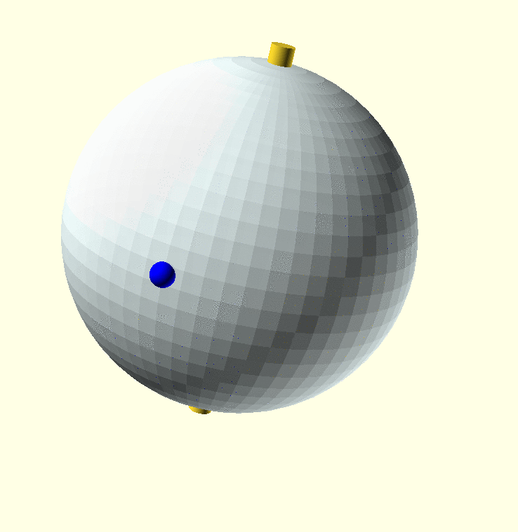
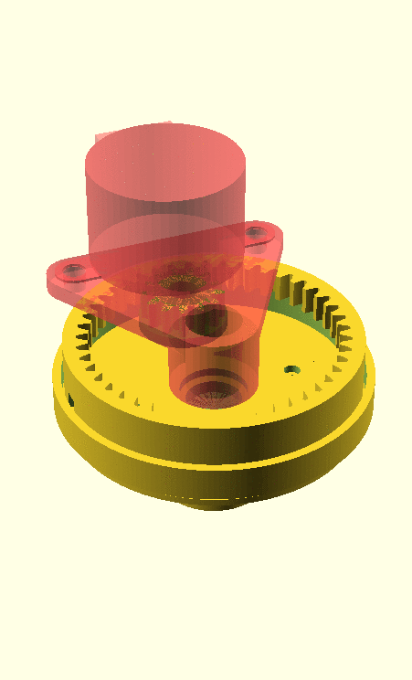

# SaS Globe

The SaS Globe project aims at creating a physical globe (a spherical model of Earth) that can follow the trip of a vessel (a sailing ship in this case).




The idea it to mechanize an existing off the self globe to pinpoint the location of interest on the surface. The design calls for a way to turn the globe around it's axis to move the area of interested towards the viewer and show a pointer at the correct elevation.

https://youtu.be/XW6XudH7p7o


https://youtu.be/qj2XHyfu8BA

[Don't be shy donate some money](https://www.paypal.com/cgi-bin/webscr?cmd=_donations&business=WPQZVQW5XM5S8&item_name=Sem+at+Sea+2019&currency_code=EUR&source=url) for [Sem's adventure](https://www.sem-at-sea.nl/) 

# Hardware

In terms of hardware we need a globe that can be mechanized. Some way to turn the globe without all the wires 

## Axis movement

For the horizontal movement (longitude) we want to be able to rotate the globe freely. To allow wires in the globe we want to create a platform that can rotate around a pipe to be able to pass wires in its hole.

We plan on 3d printing a component for this that will be driven by a stepper motor. 



The globe will try to maintain state over power cycles but will also need to contain functionality for homing. 

## Elevation

The globe itself will be turning to present the area of interest to the user. The pointer device will not need to turn relative the the movement of the globe but rather can stand still and only move its hight (latitude).

For this we can use a servo motor. 

## Pointer

The pointer can either be a led mounted on a stick or a laser pointer also mounted inside the globe. The pointer can be turned on an off. 

The esp module is not strong enough to drive a led or laser. We will need to use a small transistor for this.

```
--5v--------------------\
                        |+
                      laser
                        |-
                      |/
--led power--[r330]---| (npn 547b Hef 200 max 0.2 A)
                      |\
                        |
--gnd-------------------|


```


## Interaction

To be able to interact with the globe it will require some input.communicate with the globe it will require connectivity. We plan to use esp for this.

# Software

## Firmware

The software running on the esp8866 in the globe. It provides a captive portal for wifi configuration and is in charge of controlling the steppper motors, the servo and be able to perform calibration. 

## Serverware

The (nodejs based) application running on our server. This is the control center that can control the globe. It can also push software updates

## Clientware

Software that talks to the serverware to request actions (like moving the point of interest to a different place. 

# Pinout


There is a [list of "usable" pin](https://randomnerdtutorials.com/esp8266-pinout-reference-gpios/) that can help figure out what pint to use. Overall only few pins are usable 100% of the time. Some will have pullup and others pulldown (to force boot modes) 2 are used for tx/tx.


| GPIO | D    | Functionality     |
|------|------|-------------------|
| D4 | GPIO2  | Servo pin         |
|    |        | Wifi reset pin    | 
| D0 | GPIO16 | Homing sensor pin |
| D1 | GPIO5  | Led enable  pin   |
| D5 | GPIO14 | Stepper[0][0]     |
| D6 | GPIO12 | Stepper[0][1]     |
| D7 | GPIO13 | Stepper[0][2]     |
| D8 | GPIO15 | Stepper[0][3]     |

D0 is high at boot


# Security

* No hardcoded credentials?
* Code has been fuzzed or reviewed?
